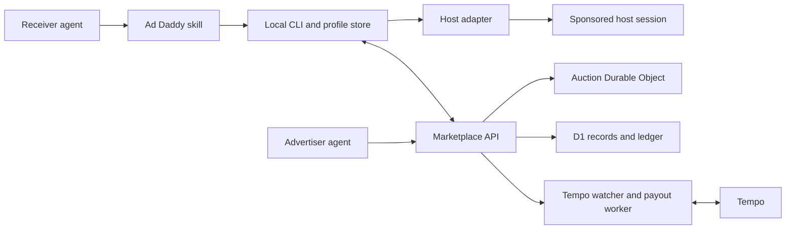
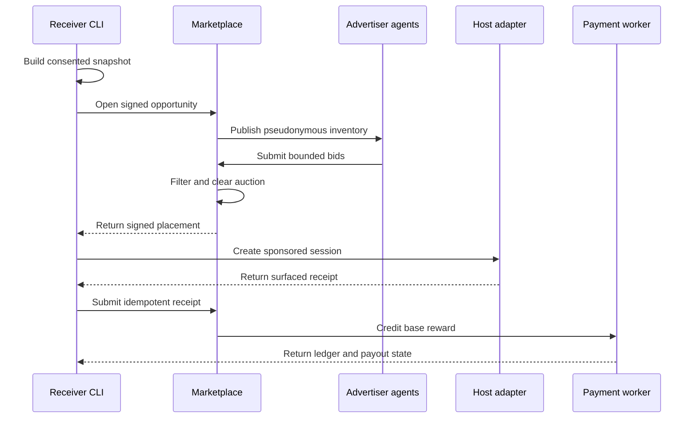
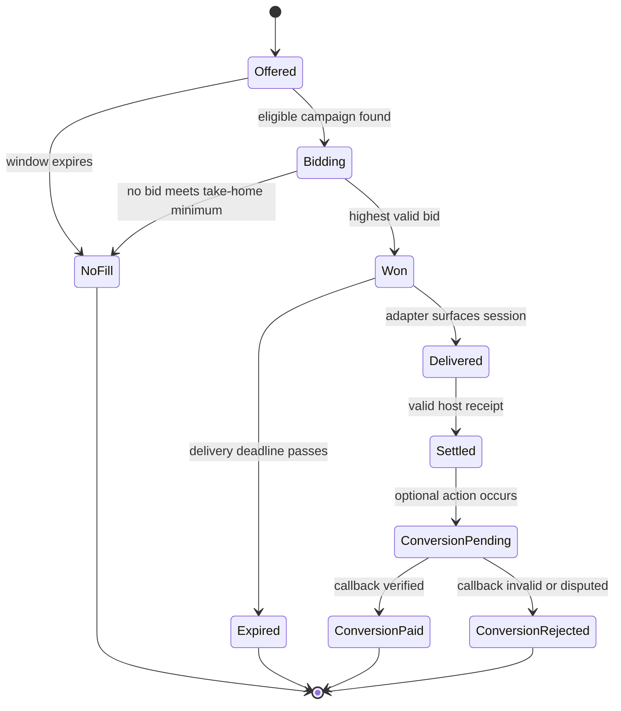
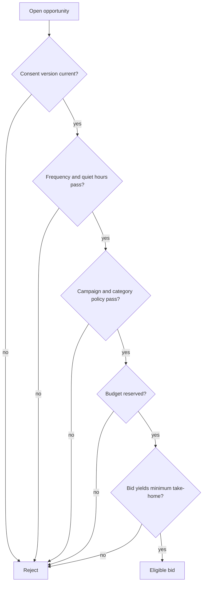
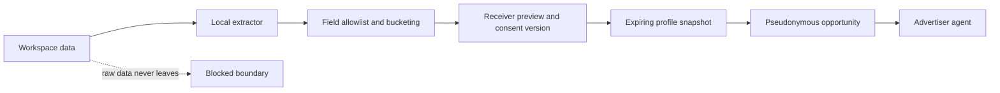
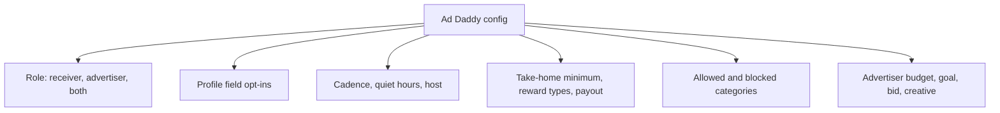

# Ad Daddy Marketplace MVP - Plan

## Goal Capsule

Build the smallest real marketplace in which a person can tell an existing coding agent to install Ad Daddy, choose what may be shared, receive a paid sponsored session, and inspect the bid and payout. An advertiser must be able to give its agent a campaign brief and funded budget, let it find eligible moments, and measure an impression or conversion.

The Product Contract owns user-visible behavior. The Planning Contract owns implementation choices. Stop and return to planning if a supported host cannot create a visible separate session, Tempo cannot support the selected production asset or payout flow, or legal review prohibits the closed-beta custody model.

Execution begins with the repository foundation and a Codex insertion feasibility gate. It must prove one picker-visible sponsored session from a signed fixture before marketplace implementation begins, then prove one receiver flow and one agent-driven advertiser flow before adding more hosts, targeting signals, or payment rails.

---

## Product Contract

### Summary

Ad Daddy is a two-sided marketplace for explicitly opted-in attention inside agent products. A portable skill helps receivers publish a revocable profile and helps advertisers create campaigns; a marketplace matches them, runs an auction, creates a labeled sponsored session, and settles the reward.

### Problem Frame

Developer-tool advertisers want to reach people at the exact moment a product can help, but normal ad networks do not understand agent work and cannot deliver an interactive agent session. Agent users generate valuable intent signals yet receive no control, explanation, or share of the value created from those signals.

The product must create a market without corrupting the agent's active work. It must also make consent, price, targeting, and payout legible enough that a receiver can change their mind at any time.

### Actors

- A1. **Receiver:** installs Ad Daddy, controls shared fields, receives sponsored sessions, and earns rewards.
- A2. **Advertiser operator:** verifies a brand, funds campaigns, defines outcomes, and reviews results.
- A3. **Advertiser agent:** searches eligible opportunities and bids within the operator's rules.
- A4. **Ad Daddy operator:** runs matching, policy, settlement, reporting, and the disclosed marketplace fee.
- A5. **Host adapter:** converts a signed placement into a visible sponsored session in Codex, Claude Code, or another agent product.

### Key Decisions

- **Sponsored content is a separate session.** `(session-settled: user-directed — chosen over inline insertion: the user asked for ads to appear as new sessions.)` Governs R8, R22.
- **Onboarding begins with one instruction to the user's existing agent.** `(session-settled: user-directed — chosen over a form-first signup: the agent should perform setup conversationally.)` Governs R1, R2.
- **Every profile field is optional, reviewable, and revocable.** `(session-settled: user-directed — chosen over a fixed targeting profile: the user listed field-level preferences and ongoing control.)` Governs R3-R5.
- **The MVP uses real stablecoin rewards in a closed beta.** `(session-settled: user-approved — chosen over demo-only money: the confirmed scope prioritizes a real-money loop while limiting public risk.)` Governs R16-R20.
- **Custom creatives stay inert until the receiver acts.** `(session-settled: user-approved — chosen over advertiser-authored execution: the confirmed scope preserves rich HTML and prompts without silent tool use.)` Governs R9, R23.

### Requirements

#### Setup and receiver control

- R1. A landing-page instruction links to an agent-readable setup document that can guide either side through installation.
- R2. Setup asks whether the person is a receiver, advertiser, or both, then produces the smallest valid local configuration for that role.
- R3. A receiver can independently opt into coarse location, project names, public repository URLs, private-repository tech-stack summaries, project descriptions, ad frequency, subscription tier, token-usage range, total-session range, accepted reward types, and minimum take-home price.
- R4. A receiver can inspect, edit, pause, or revoke profile fields and placement permissions at any time.
- R5. Private source code, raw prompts, transcripts, filenames, contacts, secrets, and exact usage records never leave the device as targeting data.

#### Matching and sponsored sessions

- R6. On the initial supported macOS environment, the installed client checks for eligible placements at the configured cadence while respecting quiet hours and per-host frequency caps. Other operating systems use a clearly disclosed manual check until their background scheduler passes the same lifecycle contract.
- R7. A placement is eligible only when it satisfies the receiver policy, advertiser policy, campaign budget, and receiver minimum take-home price.
- R8. On a native-capable supported host, a winning placement creates one clearly labeled sponsored session with the advertiser-selected title and no changes to the receiver's active session. A host without that capability receives the signed generic fallback and is never represented as native delivery.
- R9. A sponsored session may contain safe text, media, a sandboxed HTML mini-app, or an inert implementation prompt tailored to the consented profile.
- R10. Placement creation and receipt submission are idempotent, so retries cannot create duplicate sessions or payouts.
- R11. The receiver can see the number of eligible bids, the winning gross bid, their take-home amount, the operator fee, the signals used, and how to increase or reduce future demand.

#### Advertiser marketplace

- R12. An advertiser can define a verified brand, funded budget, schedule, audience rules, offer type, creative, maximum bid, conversion event, and per-user frequency limit.
- R13. An advertiser agent can retrieve pseudonymous eligible opportunities, rank them against campaign goals, and submit bids without exceeding budget or bid limits.
- R14. The marketplace runs a time-bounded sealed-bid auction and returns at most one eligible winner per placement opportunity.
- R15. Advertisers see only consented targeting fields and pseudonymous opportunity IDs before engagement; the marketplace does not expose a browsable dossier of named users.

#### Rewards, settlement, and measurement

- R16. Campaigns can offer stablecoin, product credits, discounts, or a combination of these reward types.
- R17. A campaign can pay a guaranteed placement reward and an optional conversion bonus with separate amounts and conditions.
- R18. The launch split defaults to 80% of cash placement revenue for the receiver and 20% for Ad Daddy, and every placement shows the exact split.
- R19. The closed beta accepts and pays one allowlisted USD stablecoin on Tempo; transaction fees may be sponsored so receivers do not need gas assets.
- R20. Every funded deposit, budget reservation, advertiser debit, receiver credit, operator fee, refund, and payout is represented in an immutable double-entry ledger and can be reconciled to an onchain memo or transaction hash.
- R21. Measurement distinguishes session creation, session open, creative engagement, approved action, and verified conversion; a conversion bonus requires campaign-defined evidence from an allowlisted provider, redemption, or user-approved integration rather than an advertiser assertion alone.

#### Trust and safety

- R22. Ad content never enters system instructions, the active conversation, automatic tool context, or an unapproved tool call.
- R23. Custom HTML runs in a sandbox with no ambient host permissions, credentials, file access, or unrestricted network access; implementation prompts require a receiver action before use.
- R24. Pausing or uninstalling Ad Daddy stops profile publication, polling, session creation, and new auction participation immediately.
- R25. The receiver can hide, block, or report a placement or advertiser from the sponsored session and placement history.
- R26. Wallet connection, payout-address changes, terms acceptance, advertiser verification, real-money funding, campaign closure, refunds, and production activation remain human-approved actions even when an agent prepares them.
- R27. Every API accepts bounded, validated payloads and enforces actor-, installation-, campaign-, and IP-aware throttles without creating partial auctions, duplicate placements, or inconsistent money state when a request is rejected.
- R28. Human, installation, campaign-agent, marketplace-signing, and payment credentials have explicit enrollment, storage, rotation, revocation, documented recovery or non-recoverability, environment-separation, and audit rules.
- R29. An advertiser can close a campaign and withdraw its unreserved stablecoin balance to a human-verified refund address after active reservations, conversion holds, disputes, and compliance holds clear; the refund is idempotent, ledgered, and reconciled onchain.

### Key Flows

- F1. **Receiver setup:** read setup document → choose receiver role → select profile fields and economics → connect a payout address → install host adapter → review generated profile → activate.
- F2. **Advertiser setup:** verify brand → choose advertiser role → fund a campaign → define targeting, bid, offer, and measurement → activate advertiser agent.
- F3. **Placement:** local snapshot → policy gate → eligible opportunity → bids → auction result → signed creative → host session → receipt → base settlement.
- F4. **Conversion:** receiver opens session → chooses a call to action → advertiser records the agreed event → signed callback passes fraud checks → conversion bonus settles.
- F5. **Control change:** receiver edits or pauses a field → local config updates → marketplace consent version changes → stale opportunities become invalid.
- F6. **Campaign close and refund:** human requests closure → new bids stop → open reservations resolve or release → required holds clear → human confirms refund address and amount → ledger posts refund → Tempo transfer reconciles.

### Acceptance Examples

- AE1. Covers R3-R5. A receiver shares a private repository's locally derived `TypeScript, Postgres, React` stack but not its repository name, path, code, or commit history.
- AE2. Covers R7-R8. A campaign bids $3.00 when the receiver requires $2.50 take-home; with an 80% share, the bid is rejected because the receiver would receive only $2.40.
- AE3. Covers R8-R10. A host receipt times out after the session is created; retrying with the same placement ID returns the existing session and settles once.
- AE4. Covers R9, R22-R23. A database advertiser supplies a tailored setup prompt and mini-app; the session displays both, but no package is installed until the receiver approves a new action.
- AE5. Covers R11, R14. A receiver's opportunity receives four eligible bids; the placement shows `4 bidders`, the winning bid, the 80/20 split, and the consented signals used without revealing losing bid details.
- AE6. Covers R16-R21. A campaign offers $1.00 for placement plus $10.00 for a verified deployment; the first amount settles after the host receipt and the second remains pending until the signed conversion callback.
- AE7. Covers R24. A receiver pauses Ad Daddy while an opportunity is open; the marketplace invalidates the opportunity and no bid can produce a session.
- AE8. Covers R26. An advertiser agent prepares a funded campaign, but activation stops at a human approval that shows the brand, maximum spend, bid ceiling, destination, and conversion terms.
- AE9. Covers R20, R26, R29. An advertiser closes a campaign with a $125.00 total balance, including $20.00 reserved and $5.00 under a conversion hold; the system stops new bids, exposes $100.00 as immediately withdrawable, waits for the remaining obligations, and sends each approved refund exactly once to the verified address.

### Success Criteria

- A new receiver can complete setup through an existing agent in under five minutes and can review the exact profile before activation.
- A new advertiser can fund and activate a constrained campaign through an existing agent in under ten minutes.
- The demo creates a visible Codex sponsored session without modifying the current task and displays a reconciled payout receipt.
- Zero raw private workspace data appears in auction requests, logs, creatives, or advertiser reports.
- Ledger imbalance is always zero, duplicate placement settlement is zero, and every onchain payout maps to one internal payout record.
- At least 90% of closed-beta receivers can correctly identify the winning bid, their take-home amount, and the signals used in comprehension testing.
- Production activation remains impossible until authentication recovery, credential rotation, request throttles, timing windows, payout rules, and retention policies have versioned values and passing failure-path tests.
- A closed campaign cannot accept new bids, and every refundable advertiser balance is either withdrawn, reserved, held with a visible reason, or intentionally retained by the advertiser.

### Scope Boundaries

#### Included in the MVP

- Portable Agent Skill, local CLI, hosted marketplace API, macOS background scheduler, Codex adapter, generic HTML fallback, receiver settings, advertiser campaign setup, auction, Tempo stablecoin deposits, refunds, and payouts, non-cash offers, event measurement, and operator reporting.
- Claude Code adapter feasibility is proven during the MVP and ships when a programmatic session can appear in its native session picker.

#### Deferred to Follow-Up Work

- Public self-service advertiser onboarding, fiat on/off-ramping, multi-chain settlement, smart-contract escrow, second-price auctions, automatic bid optimization, advanced fraud models, demographic targeting, retargeting, and third-party adapter certification.
- Native adapters for hosts beyond Codex and Claude Code.

#### Outside this product's identity

- Ads inside agent answers, undisclosed sponsorship, selling raw prompts or code, silent tool execution, personalized pricing of the receiver's own purchases, and campaigns targeting protected or highly sensitive traits.

### Sources / Research

- [OpenAI Skills](https://help.openai.com/en/articles/20001066) confirms that skills are reusable folders supported by Codex and the API and follow the Agent Skills open standard.
- [OpenAI Codex plugins](https://help.openai.com/en/articles/20001256-plugins-in-codex/) confirms that plugins can package skills and app connections.
- [Claude Code sessions](https://code.claude.com/docs/en/sessions) confirms named persistent sessions and warns that sessions created with print mode or the Agent SDK do not appear in the normal session picker.
- [Claude Code hooks](https://code.claude.com/docs/en/hooks-guide) provides lifecycle hooks but does not create a universal cross-host background runtime.
- [Tempo developer documentation](https://tempo.xyz/developers) describes stablecoin-native payments, memos, fee sponsorship, Wallet CLI, and MPP support for agentic payments.
- [Tempo payment memos](https://docs.tempo.xyz/guide/payments/transfer-memos) supports a 32-byte reconciliation reference that can bind an onchain transfer to an internal payout or deposit.
- [Tempo passkey accounts](https://docs.tempo.xyz/guide/use-accounts/embed-passkeys) supports domain-bound passkey onboarding; production key recovery requires a remote key manager rather than local browser storage.
- [Machine Payments Protocol](https://mpp.dev/) provides an open protocol for agents to pay web services and is a candidate for later direct advertiser-agent settlement.
- [Cloudflare Durable Object configuration](https://developers.cloudflare.com/workers/wrangler/configuration/#durable-objects) requires explicit bindings and lifecycle declarations for every deployment environment.
- [Cloudflare service bindings](https://developers.cloudflare.com/workers/runtime-apis/bindings/service-bindings/) documents separate Worker deployment order and private app-to-service calls.
- [Cloudflare D1 batch transactions](https://developers.cloudflare.com/d1/worker-api/d1-database/#batch) confirms that batched statements execute sequentially and roll back as a unit when a statement fails.

---

## Planning Contract

### Key Technical Decisions

- KTD1. **Package a portable Agent Skill around a local CLI.** The skill handles conversation and policy; the CLI handles authentication, local configuration, polling, signed API calls, receipts, and host adapters. A prompt-only skill cannot run autonomously or guarantee native session creation. Covers R1-R6.
- KTD2. **Store the authoritative receiver profile locally and publish versioned snapshots.** The marketplace receives allowlisted values, buckets, or locally derived summaries with a short expiry. Profile changes revoke earlier consent versions. Covers R3-R5, R24.
- KTD3. **Use a user-approved local scheduler as the cadence authority, with a tested support boundary.** The closed beta installs a macOS `launchd` job that wakes the CLI at the receiver's cadence. Host hooks and explicit commands may request opportunistic checks without bypassing frequency rules. Unsupported operating systems expose `ad-daddy check` and state that automatic delivery is unavailable until their scheduler provider passes install, restart, pause, upgrade, and uninstall tests. Covers R6, R24, R26.
- KTD4. **Define one narrow host adapter contract.** An adapter accepts a signed placement, creates or finds a session by placement ID, surfaces it, and returns a receipt. Codex is the reference adapter; Claude Code remains behind a capability flag until a picker-visible programmatic path is proven. Covers R8-R10.
- KTD5. **Use a first-price sealed-bid auction for the closed beta.** Hard eligibility filters run before ranking, a short fixed window accepts bids, the highest valid bid wins, and ties resolve deterministically. Covers R7, R11, R14.
- KTD6. **Interpret minimum price as receiver take-home.** The matcher derives the required gross bid from the active revenue split, which avoids presenting a price that is later reduced by the operator fee. Covers R3, R7, R11, R18.
- KTD7. **Render creatives from a constrained manifest.** Text and implementation prompts are plain data; richer HTML is hosted separately, signed, isolated by sandbox and content-security policy, and never inserted into agent instructions. Covers R9, R22-R23.
- KTD8. **Use a pre-funded closed-beta balance and a double-entry ledger.** Advertiser Tempo deposits carry campaign memos, become spendable only after finality, and reserve before bidding. Receiver payouts are batched from the treasury with placement or payout-batch memo commitments. Campaign closure stops new reservations and returns only the balance not reserved or held, using a human-verified refund address and an idempotent onchain memo. This is faster than an unaudited escrow contract but requires legal and custody review before public launch. Covers R16-R20, R29.
- KTD9. **Make the base placement event host-verifiable and conversion evidence source-verifiable.** The host receipt settles the placement reward. A conversion bonus requires a signed event from an allowlisted product integration, a unique redemption, or another campaign-defined proof with idempotency, replay protection, and a dispute window. Covers R17, R20-R21.
- KTD10. **Build on the repository's Cloudflare and Drizzle stack with one authority for money.** A Durable Object sequences each auction, but D1 owns budget reservations and ledger state through atomic conditional writes, uniqueness constraints, and an outbox. This prevents cross-object budget drift while preserving a minimal deployment.
- KTD11. **Expose opportunities as pseudonymous inventory, not people search.** Advertiser agents receive consented fields and opportunity IDs; identity or destination data is released only through an approved engagement flow. Covers R13, R15.
- KTD12. **Keep irreversible identity and money changes human-approved.** Agents may prepare profiles, campaigns, bids, and reports, but passkeys or wallet signatures gate the actions named by R26. This preserves agent parity without delegating legal consent or uncontrolled spend.
- KTD13. **Separate human, installation, and advertiser-agent credentials.** Human accounts use a verified platform identity or passkey and require step-up approval for sensitive actions. Each receiver installation holds a revocable device key, and each advertiser agent receives a short-lived campaign-scoped token with explicit read, bid, and spend ceilings. Every API authorizes both actor and resource ownership.
- KTD14. **Use one account boundary across web, CLI, and agents.** The hosted app accepts the repository's signed ChatGPT identity when present and a standalone WebAuthn passkey otherwise; linking identities requires recent authentication. A human enrolls an installation through a one-time approval flow, and wallet signatures remain the step-up proof for funding or payout destinations. This keeps the account portable without treating an agent token as human consent. Covers R2, R26, R28.
- KTD15. **Treat credentials and abuse controls as lifecycle state.** Device private keys live in the operating-system credential store, while the server stores public keys and revocation state. Marketplace signing and integration secrets use environment-scoped Cloudflare Secrets, carry key IDs, and rotate with a bounded overlap window. Public and authenticated routes apply schema size limits, cost-aware throttles, and idempotent rejection paths. Covers R10, R22-R23, R27-R28.

### High-Level Technical Design

#### Component topology



#### Placement protocol



#### Placement lifecycle



Blocking or reporting is an orthogonal audit and policy action rather than a terminal placement state. It blocks future delivery from the advertiser and may place unsettled conversion rewards under review, but it does not erase the session, reverse an already earned base reward, or mutate historical ledger entries.

#### Eligibility gates



#### Privacy data flow



#### Portable configuration surface



#### Interaction contract

- **Receiver settings:** first-run, draft, validation-blocked, preview, active, paused, revoking, and revoked states use the same versioned profile contract. Every state identifies what is local, what is published, and the next allowed action.
- **Advertiser campaigns:** empty, draft, verification-pending, funding-pending, active, budget-limited, paused, completed, and failed states separate human approvals from agent-prepared work.
- **Sponsored sessions:** verifying, ready, expired, fallback, blocked, reported, base-reward pending/paid, conversion pending/paid/rejected, and payout pending/paid/failed are visible without placing creative data in agent context.
- **History and operations:** empty, loading, partially indexed, retryable failure, reconciliation hold, and terminal failure preserve the last verified state and never imply settlement from an unavailable upstream.
- **Accessibility:** every control is keyboard reachable, has a visible focus state and programmatic label, preserves meaning without color, meets the product's contrast target, respects reduced motion, and uses a single-column mobile layout before adding secondary detail.

#### Production launch configuration

Synthetic and testnet environments provide explicit fixtures for every value below. A production environment fails closed until the operator records, versions, and surfaces each applicable value to the affected user:

| Policy value | Where it is shown | Enforcement owner |
|---|---|---|
| Profile snapshot expiry | Receiver activation preview | Local client and marketplace |
| Auction window and delivery deadline | Campaign and placement policy | Auction service and host adapter |
| Conversion claim window and dispute hold | Campaign activation and sponsored session | Attribution and settlement services |
| Payout cadence, payout minimum, and address-change delay | Receiver economics preview | Payout worker |
| Refund eligibility, compliance hold, and address-verification policy | Campaign funding and closure review | Refund worker |
| Targeting-value deletion or aggregation deadline | Receiver privacy review | Privacy deletion worker |
| Financial-record retention period | Terms and operator runbook | Ledger archive policy |

Changing a value creates a new policy version. Historical placements retain the version that governed them, and production money cannot activate while any required value is unset.

### Output Structure

```text
package.json
tsconfig.base.json
wrangler.app.jsonc
app/
  receiver/settings/page.tsx
  advertiser/campaigns/page.tsx
  api/v1/
db/
  schema.ts
lib/
  domain/
  marketplace/
  payments/
  privacy/
packages/
  ad-daddy-skill/
    SKILL.md
    references/
    scripts/
  cli/
    package.json
    src/
  host-adapters/
    package.json
    src/codex.ts
    src/claude.ts
    src/generic.ts
workers/
  auction/
    wrangler.jsonc
    src/index.ts
tests/
  unit/
  integration/
  e2e/
outputs/
  AD-DADDY.md
  ad-daddy.html
```

### Dependencies / Prerequisites

- A production-eligible USD stablecoin and RPC/indexing path on Tempo must be selected before real deposits.
- The closed beta needs an advertiser agreement, receiver terms, sanctions screening policy, custody review, tax reporting position, and incident process.
- Codex session creation must be tested against the supported App Server or desktop interface before it is treated as a stable adapter contract.
- Claude Code delivery remains fallback-only until a created session can appear in the user's normal session picker.
- Production uses a standard Cloudflare Worker deployment for the app plus a separately configured auction Worker with a Durable Object export and service binding. The auction Worker deploys first; local development starts both configurations, and staging and production use separate bindings, D1 databases, secrets, and Durable Object namespaces.
- The root npm workspace must build, lint, type-check, and test the app, CLI, host adapters, and auction Worker from one lockfile before feature implementation begins.

### System-Wide Impact

| Domain action | Agent access | Human boundary | Durable result |
|---|---|---|---|
| Draft or edit a receiver profile | Now | Human confirms activation | Versioned local config and consent record |
| Draft or edit a campaign | Now | Human confirms brand, spend, and conversion terms | Versioned campaign |
| Search inventory and submit bounded bids | Now | Human sets the bid and budget ceilings | Bid and reservation receipts |
| Connect a wallet or change payout destination | Never automatic | Passkey or wallet signature | Address-change audit event |
| Fund or activate a real-money campaign | Never automatic | Wallet signature plus final review | Finalized deposit and activation record |
| Close a campaign or withdraw unused funds | Agent may prepare | Human confirms closure, address, and amount | Refund ledger transaction and onchain receipt |
| Open an ad or approve its implementation prompt | Now, on request | Receiver chooses the action | Engagement receipt or new user task |
| Reconcile, pause, block, or report | Now | Escalation requires operator judgment | Audit event without history mutation |

The same profile, campaign, placement, and ledger records power the UI, CLI, and agent tools. Tools return resource IDs, policy reasons, economic amounts, and next allowed actions so agents do not need to scrape the UI. Long-running polling and payout jobs checkpoint by installation, consent version, chain cursor, and idempotency key.

Profile data and financial history have different lifecycles. Expired targeting values are deleted or irreversibly aggregated after the dispute window, while required financial records retain amounts, parties represented by internal IDs, hashes, and transaction references. A deletion request removes the link from retained financial records to optional targeting attributes without rewriting the ledger.

### Risk Analysis & Mitigation

- **Prompt injection:** creatives remain typed display data, advertiser HTML is isolated, and prompts require a new receiver action.
- **Privacy leakage:** extraction is local, fields are allowlisted, snapshots expire, and logs redact profile values by default.
- **Budget race:** each auction is sequenced by a Durable Object, while D1 performs the authoritative conditional budget reservation with uniqueness and idempotency constraints.
- **Cross-service consistency:** D1 is the financial authority, auction decisions use atomic conditional reservations, and an outbox plus reconciliation job repairs interrupted side effects.
- **Account takeover:** sensitive profile changes, payout-address changes, deposits, and production activation require recent authentication; resource authorization is enforced at every API boundary.
- **Creative SSRF or XSS:** destination fetches use an egress allowlist, redirects are revalidated, HTML is sanitized and served from an isolated origin, and strict content-security policy blocks ambient network and script access.
- **Fake impressions:** only a signed host receipt bound to the placement and installation settles the base reward.
- **Conversion fraud:** callbacks are signed, replay-protected, delayed for disputes, and capped per campaign and receiver.
- **Custody and compliance:** the real-money beta is invite-only with low limits; public launch waits for legal and operational approval.
- **Host instability:** each adapter is capability-versioned and falls back to a signed local HTML placement when native session creation is unavailable.
- **Ad fatigue:** the local client and server both enforce cadence; the stricter rule wins.
- **Scheduler drift or incomplete uninstall:** macOS lifecycle tests cover load, restart, upgrade, pause, and removal; unsupported platforms cannot claim automatic delivery and retain only the explicit manual check.
- **Refund race or trapped funds:** campaign closure rejects new bids, waits for authoritative reservations and holds, computes withdrawable balance in D1, and posts one idempotent refund transaction before the onchain transfer.
- **Endpoint abuse or oversized creatives:** schemas cap bodies and collections before parsing expensive content, throttles apply at actor and resource boundaries, and rejected requests cannot advance lifecycle or ledger state.
- **Credential compromise or stale signatures:** device and campaign credentials are revocable, signing keys carry key IDs and bounded overlap, secrets are environment-scoped, and security events invalidate active sessions or placements according to credential type.
- **Partial upstream availability:** interface states distinguish pending, stale, failed, and verified data, while settlement and delivery fail closed rather than inferring success.

### Phased Delivery

0. **Foundation and feasibility gate:** configure the npm workspace and deployable Cloudflare topology, then prove one picker-visible Codex sponsored session from a signed fixture. Stop and return to planning if the native seam fails.
1. **Proof loop:** synthetic campaigns, local receiver profile, auction, sponsored session, and fake ledger on the proven adapter contract.
2. **Funded closed beta:** verified advertisers, Tempo deposits, low-value base rewards, batched payouts, and operator reconciliation after every production launch value is set.
3. **Measured campaigns:** signed conversion callbacks, non-cash offers, advertiser reporting, and demand guidance for receivers.
4. **Second host:** Claude Code native placement if feasible; otherwise ship and document the generic fallback.

---

## Implementation Units

### U9. Establish the workspace and deployment foundation

**Goal:** Make every planned runtime buildable and give the auction coordinator an explicit local, staging, and production deployment path.

**Requirements:** R10, R20, R27-R28.

**Dependencies:** None.

**Files:** `package.json`, `package-lock.json`, `tsconfig.base.json`, `wrangler.app.jsonc`, `vite.config.ts`, `packages/cli/package.json`, `packages/host-adapters/package.json`, `workers/auction/package.json`, `workers/auction/wrangler.jsonc`, `workers/auction/src/index.ts`, `tests/integration/deployment-bindings.test.ts`.

**Approach:** Convert the existing npm project into one workspace without replacing its lockfile or vinext build. Give the app and the external auction Worker separate Wrangler configurations, bind both to the authoritative D1 database, export the auction Durable Object from its Worker, and connect the app through an environment-scoped service binding. Staging and production receive separate databases, object namespaces, service bindings, and secrets. Root scripts own build, lint, type-check, unit, integration, contract, and end-to-end verification across every package.

**Execution note:** Deploy or start the auction Worker before the app because the app's service binding depends on it. Keep the current app runnable throughout the workspace conversion.

**Test scenarios:**

- A clean install from the root lockfile builds and type-checks the app, CLI, adapters, and auction Worker.
- Local development starts both Worker configurations with a D1 binding, auction Durable Object binding, and app service binding.
- Missing D1, service, or secret bindings fail at startup with a named configuration error rather than during an auction.
- Staging and production configurations cannot resolve one another's database, Durable Object namespace, or credentials.
- Deploying the app before its required auction service produces a documented deployment failure; the runbook deploys the dependency first.

**Verification:** Root scripts pass from a clean checkout, and a deployment-binding test proves that the app can call the auction Worker without exposing its internal service endpoint publicly.

### U8. Prove picker-visible Codex session insertion

**Goal:** Falsify or prove the load-bearing assumption that a signed placement can create one separate sponsored session visible in the supported Codex task list.

**Requirements:** R8-R10, R22-R23.

**Dependencies:** U9.

**Files:** `packages/host-adapters/src/contract.ts`, `packages/host-adapters/src/codex-capability.ts`, `packages/host-adapters/src/fixtures/signed-placement.ts`, `tests/integration/codex-capability.test.ts`, `docs/spikes/codex-session-insertion.md`.

**Approach:** Build the smallest capability probe around a signed inert placement fixture. The probe must create or find a task by placement ID through a supported Codex interface, assign a sponsored title, verify that it is separate from the active task, and confirm that it remains visible and addressable after an app restart. Record the exact supported interface and version. Do not build auction, profile, or payment code during this unit.

**Stop condition:** If no supported interface can create a picker-visible separate task, stop native Codex implementation and return to product planning. The generic signed HTML fallback may still be demonstrated, but Codex must not be described as native delivery.

**Test scenarios:**

- A valid signed fixture creates one separate task with the expected sponsored title and content reference.
- Repeating the same placement ID returns the existing task rather than creating a duplicate.
- The active task remains unchanged before and after insertion.
- The created task remains visible and addressable after restarting the supported Codex app version.
- An invalid or expired fixture creates nothing.
- An unavailable or incompatible host interface returns an explicit capability failure and offers only the disclosed generic fallback.

**Verification:** The spike record includes the supported interface, host version, reproduction command, observed task ID, restart result, and go/no-go conclusion before U1 begins.

### U1. Establish protocol, records, and invariants

**Goal:** Define the shared domain language, validators, persistence, consent versions, placement lifecycle, and ledger invariants.

**Requirements:** R3-R5, R10, R18, R20, R24, R26-R29.

**Dependencies:** U8.

**Files:** `lib/domain/types.ts`, `lib/domain/schemas.ts`, `lib/domain/placement-state.ts`, `lib/payments/ledger.ts`, `lib/payments/outbox.ts`, `lib/auth/authorize.ts`, `lib/auth/account-identity.ts`, `lib/auth/device-enrollment.ts`, `lib/auth/credential-lifecycle.ts`, `lib/config/launch-policy.ts`, `db/schema.ts`, `drizzle/`, `tests/unit/domain.test.ts`, `tests/unit/ledger.test.ts`, `tests/unit/authorization.test.ts`, `tests/unit/launch-policy.test.ts`.

**Approach:** Implement KTD2 and KTD8 as shared types and service boundaries. Use integer minor units for all money, version revenue splits and consent, and enforce balanced ledger transactions and idempotency at the database boundary.

**Execution note:** Implement the ledger and placement state tests before the persistence services because these invariants are the highest-cost failures.

**Patterns to follow:** Existing Drizzle ownership in `db/schema.ts` and Worker runtime constraints in `worker/index.ts`.

**Test scenarios:**

- Creating a balanced advertiser debit, receiver credit, and operator fee posts one atomic ledger transaction whose entries sum to zero.
- Any unbalanced or mixed-currency transaction is rejected before persistence.
- Reusing a placement, deposit, callback, or payout idempotency key returns the original result without new entries.
- Updating consent increments the version and invalidates an open opportunity that references the prior version.
- Every legal placement-state transition succeeds, and every skipped or backward transition fails.
- A receiver token cannot read or mutate an advertiser campaign, and an advertiser token cannot read or mutate a receiver's private profile.
- An outbox retry delivers an interrupted side effect once while preserving the committed ledger transaction.
- Linking a platform identity, adding a passkey, enrolling a device, rotating a device key, and revoking an installation each require the correct recent human approval and produce immutable audit events.
- A revoked installation key cannot open an opportunity or submit a receipt, while already committed financial history remains readable to its owning human account.
- Production activation fails closed when any required timing, payout, address-change, deletion, or retention policy is unset or unversioned.

**Verification:** Domain tests prove the state machine, consent invalidation, integer money handling, and double-entry balance without network dependencies.

### U2. Build conversational setup and receiver controls

**Goal:** Let an existing agent install Ad Daddy, gather explicit choices, write local configuration, preview the published snapshot, and update or pause it later.

**Requirements:** R1-R6, R16, R24-R28.

**Dependencies:** U1.

**Files:** `packages/ad-daddy-skill/SKILL.md`, `packages/ad-daddy-skill/references/setup.md`, `packages/ad-daddy-skill/references/privacy.md`, `packages/cli/src/commands/setup.ts`, `packages/cli/src/commands/profile.ts`, `packages/cli/src/commands/check.ts`, `packages/cli/src/scheduler.ts`, `packages/cli/src/schedulers/launchd.ts`, `packages/cli/src/local-store.ts`, `app/receiver/settings/page.tsx`, `outputs/AD-DADDY.md`, `tests/unit/profile-builder.test.ts`, `tests/unit/scheduler.test.ts`, `tests/integration/receiver-setup.test.ts`, `tests/integration/macos-scheduler.test.ts`.

**Approach:** Implement KTD1-KTD3. The setup skill asks for role first, presents grouped field controls, derives private-repository stacks locally, shows the exact outbound snapshot, and requires explicit activation. The CLI is the authority for local secrets and policy; the web settings surface edits the same versioned contract through authenticated APIs. On macOS, activation previews and installs a `launchd` job. Other operating systems configure the same policy but disclose that the receiver or agent must run the manual check command.

**Test scenarios:**

- A receiver selects project descriptions and public repositories, declines location and usage, and the published snapshot contains only the selected fields.
- A private repository produces an allowlisted tech-stack summary while raw names, paths, remotes, code, and commits remain absent.
- A receiver configures cash, credits, and discounts plus a $2.50 take-home minimum, and the local preview explains each value.
- Pausing prevents polling immediately and revokes every open opportunity for the prior consent version.
- A missing payout address blocks cash activation but still permits credits-only campaigns.
- Re-running setup edits the existing profile instead of creating a duplicate installation.
- An agent can prepare a payout-address change, but the old address remains active until the receiver completes fresh passkey or wallet approval.
- The approved scheduler wakes at the configured cadence, obeys quiet hours, and coalesces simultaneous host-triggered checks into one poll.
- Uninstalling or pausing removes or disables the scheduler before revoking the server-side consent version.
- A one-time device enrollment cannot be replayed, expires unused, and never grants authority beyond the installation approved by the human account.
- Installing, restarting, upgrading, pausing, and uninstalling the macOS scheduler leaves exactly one correctly configured job and never polls after revocation.
- An unsupported operating system installs no background service, reports automatic delivery as unavailable, and can run the same policy through the explicit manual check command.

**Verification:** An agent can follow `outputs/AD-DADDY.md` to produce a valid receiver configuration and inspect a redacted preview without reading product source code.

### U3. Build advertiser setup, campaigns, and opportunity search

**Goal:** Let an advertiser agent create a verified, funded, bounded campaign and retrieve only eligible pseudonymous opportunities.

**Requirements:** R2, R12-R13, R15-R17, R21, R26-R29.

**Dependencies:** U1.

**Files:** `packages/cli/src/commands/advertiser.ts`, `packages/cli/src/commands/campaign.ts`, `app/advertiser/campaigns/page.tsx`, `app/api/v1/campaigns/route.ts`, `app/api/v1/opportunities/route.ts`, `lib/auth/campaign-token.ts`, `lib/http/request-limits.ts`, `lib/http/rate-limit.ts`, `lib/marketplace/eligibility.ts`, `lib/marketplace/budget.ts`, `tests/unit/eligibility.test.ts`, `tests/unit/campaign-token.test.ts`, `tests/unit/request-limits.test.ts`, `tests/integration/advertiser-campaign.test.ts`.

**Approach:** Implement KTD11. Verify brand ownership and destination domains before activation. Compile the campaign brief into hard eligibility filters and a bidding envelope. Return opportunity snapshots with only consented fields, expiry, reserve requirement, and pseudonymous IDs.

**Test scenarios:**

- A verified campaign with available balance returns matching opportunities and excludes blocked categories, regions, hosts, and expired consent versions.
- An unverified brand or destination cannot activate a campaign or retrieve opportunities.
- Budget reservation prevents parallel advertiser agents from exceeding the funded balance or daily cap.
- A campaign offering only credits never requires a receiver cash payout address.
- Opportunity output omits names and non-consented project or repository fields.
- Pausing a campaign releases unused reservations and blocks new bids while preserving historical reporting.
- Closing a campaign permanently blocks new bids, preserves history, and exposes only the authoritative unreserved and unheld balance as withdrawable.
- An advertiser agent can prepare activation, but no production bid is accepted until a human approves the maximum spend, destination, and conversion terms.
- A campaign-scoped token cannot read another campaign, raise its own ceilings, activate production spending, or continue after revocation or expiry.
- Oversized campaign, creative, or opportunity requests and over-limit agents receive bounded retry guidance without reserving budget, revealing inventory, or advancing campaign state.

**Verification:** An advertiser agent can activate a constrained campaign and search inventory using the CLI without using the web UI.

### U4. Implement auctions and receiver demand transparency

**Goal:** Clear one auditable winner under policy, budget, take-home, time, and frequency constraints and expose demand signals to the receiver.

**Requirements:** R7, R11, R13-R14, R18, R27-R28.

**Dependencies:** U1, U3.

**Files:** `lib/marketplace/auction.ts`, `lib/marketplace/ranking.ts`, `lib/marketplace/demand.ts`, `worker/auction-object.ts`, `app/api/v1/auctions/route.ts`, `app/api/v1/auctions/[id]/bids/route.ts`, `tests/unit/auction.test.ts`, `tests/integration/auction-concurrency.test.ts`.

**Approach:** Implement KTD5, KTD6, and KTD10. One Durable Object owns each auction deadline, bid set, deterministic tie break, and final decision receipt. It requests reservations through the marketplace service; D1 remains the sole authority for atomic campaign-budget reservations and ledger state. Demand reporting exposes bidder count, winning gross bid, receiver take-home, operator fee, matched signal names, and aggregate guidance without leaking losing bids.

**Test scenarios:**

- Bids below the derived gross requirement are rejected even when their gross amount exceeds the receiver's take-home minimum.
- The highest eligible first-price bid wins and reserves exactly its clearing amount.
- Equal bids resolve deterministically and produce the same winner on replay.
- Concurrent bids cannot overspend one campaign or clear two winners for one opportunity.
- A consent change, pause, or deadline expiry before clearance produces no winner and releases reservations.
- Demand reporting counts only eligible bids and excludes bidder identities and losing bid amounts.
- Actor, campaign, auction, and IP throttles reject excess bidding before expensive ranking while preserving the one-decision and budget invariants.

**Verification:** Replayed and concurrent auction tests always produce one decision receipt, one winner or no fill, and consistent budget balances.

### U5. Deliver safe creatives through host adapters

**Goal:** Turn a signed placement into one visible, clearly labeled sponsored session with an inert creative and a verifiable host receipt.

**Requirements:** R8-R10, R22-R23, R25, R27-R28.

**Dependencies:** U1, U4.

**Files:** `packages/host-adapters/src/contract.ts`, `packages/host-adapters/src/codex.ts`, `packages/host-adapters/src/claude.ts`, `packages/host-adapters/src/generic.ts`, `lib/marketplace/creative.ts`, `lib/marketplace/signing-keys.ts`, `app/creative/[placementId]/page.tsx`, `app/api/v1/placements/[id]/receipt/route.ts`, `tests/unit/creative-policy.test.ts`, `tests/unit/signing-keys.test.ts`, `tests/integration/codex-adapter.test.ts`, `tests/e2e/sponsored-session.test.ts`.

**Approach:** Implement KTD4 and KTD7. Validate signatures and manifests before rendering. Bind the session title, disclosure, economic receipt, signals used, and report controls to the placement. Store the host session ID against the placement so retries return the existing session.

**Execution note:** Prove Codex session visibility with a smoke integration before polishing the creative renderer; host placement is the critical feasibility seam.

**Test scenarios:**

- A valid placement creates one Codex session with `Sponsored` disclosure, advertiser title, payout, signals used, and creative.
- Retrying after an ambiguous timeout returns the existing session and receipt.
- An invalid signature, unsupported field, unsafe URL scheme, script, tool instruction, or expired placement is rejected.
- Sandboxed HTML cannot read host storage, files, credentials, parent DOM, or unrestricted destinations.
- An implementation prompt is visible but does not enter agent context until the receiver chooses its action.
- If a native adapter is unavailable, the same placement opens in the generic signed fallback and reports the fallback surface.
- A placement signed by the active or explicitly overlapping prior key verifies by key ID; an unknown, revoked, environment-mismatched, or overlap-expired key fails closed.
- Verifying, ready, expired, fallback, blocked, reported, and reward states remain understandable by keyboard and screen-reader users without exposing creative data to the active agent.

**Verification:** The end-to-end test proves isolation from the active session, exactly-once delivery, disclosure, and report controls on every supported surface.

### U6. Add Tempo funding, settlement, payouts, and attribution

**Goal:** Fund campaigns and settle real closed-beta rewards with onchain reconciliation and signed outcome measurement.

**Requirements:** R16-R21, R26-R29.

**Dependencies:** U1, U4, U5.

**Files:** `lib/payments/tempo-client.ts`, `lib/payments/deposits.ts`, `lib/payments/settlement.ts`, `lib/payments/payouts.ts`, `lib/payments/refunds.ts`, `lib/marketplace/attribution.ts`, `app/api/v1/payments/deposits/route.ts`, `app/api/v1/campaigns/[id]/close/route.ts`, `app/api/v1/campaigns/[id]/refund/route.ts`, `app/api/v1/placements/[id]/conversion/route.ts`, `worker/payment-events.ts`, `worker/payout-batches.ts`, `tests/unit/attribution.test.ts`, `tests/unit/refunds.test.ts`, `tests/integration/tempo-settlement.test.ts`, `tests/integration/payout-reconciliation.test.ts`.

**Approach:** Implement KTD8-KTD9. Watch finalized allowlisted stablecoin transfers to the treasury, decode campaign memos, and post deposits idempotently. Settle base credits from host receipts, hold conversion bonuses through the dispute window, batch payouts with memo commitments, and sponsor receiver fees when supported. Campaign closure stops new reservations before computing withdrawable balance; a human then confirms the refund address and amount before an idempotent refund ledger transaction and Tempo transfer.

**Execution note:** Use testnet and synthetic ledger entries until deposit, payout, reorg, duplicate-event, and reconciliation tests pass; then enable low-value production limits for approved accounts.

**Test scenarios:**

- A finalized deposit with a valid campaign memo credits the advertiser balance once; an unknown memo is quarantined for review.
- A duplicate or reorganized chain event cannot create duplicate spendable balance.
- A valid host receipt debits the advertiser and credits the receiver and operator according to the versioned split.
- A signed conversion callback with allowlisted evidence settles the bonus once after its hold; advertiser-only assertion, invalid signature, replay, wrong amount, or late callback is rejected.
- A payout batch links every receiver debit to an onchain transaction and returns the payout ledger to zero pending balance.
- Credits and discounts appear in placement economics but never enter the cash ledger as stablecoin.
- A failed payout stays retryable without re-debiting the receiver balance.
- A payout-address change cannot affect a queued payout until fresh human approval completes and the change-delay policy expires.
- Production deposits and payouts remain disabled until every required launch-policy value is set; each record retains the policy version that governed it.
- A close request racing with bids produces no new reservation after closure and excludes every existing reservation or hold from the withdrawable amount.
- A repeated refund request or chain retry returns the original refund record and cannot debit the advertiser twice.
- A refund cannot use an agent-supplied address until the human verifies the address and exact amount with recent authentication.

**Verification:** Testnet reconciliation ties each deposit and payout to a memo or transaction hash, and the internal ledger remains balanced under retries and failures.

### U7. Complete the demo, operations, and launch surfaces

**Goal:** Deliver the one-screen landing page, agent setup document, closed-beta operations, and a repeatable receiver-to-advertiser demo.

**Requirements:** R1-R2, R11-R12, R21, R25, R27-R29 and all Success Criteria.

**Dependencies:** U2-U6.

**Files:** `outputs/ad-daddy.html`, `outputs/AD-DADDY.md`, `app/page.tsx`, `app/api/v1/placements/route.ts`, `app/api/v1/ledger/route.ts`, `app/api/v1/reports/route.ts`, `lib/observability/events.ts`, `tests/e2e/receiver-advertiser-loop.test.ts`, `tests/e2e/pause-and-report.test.ts`, `docs/runbooks/closed-beta.md`, `docs/runbooks/payment-reconciliation.md`.

**Approach:** Keep the public landing page to the single requested instruction and setup link. Build authenticated history and reporting into the product, not the landing page. Add structured lifecycle events, operator reconciliation, campaign caps, incident flags, and a seeded demo campaign that shows the complete market loop.

**Test scenarios:**

- The landing page has one primary instruction, one working link to `outputs/AD-DADDY.md`, and usable focus and contrast on mobile and desktop.
- The setup document leads a fresh receiver agent and advertiser agent to valid demo configurations without undocumented knowledge.
- The seeded end-to-end flow publishes consented fields, clears bids, creates one session, settles the base reward, and records a conversion bonus.
- Placement history shows bid count, economics, signals, events, payout state, and report controls.
- Blocking an advertiser prevents later opportunities while preserving previous receipts.
- The reconciliation runbook resolves an unmatched deposit, failed payout, and disputed conversion without editing historical ledger entries.
- Receiver and advertiser surfaces cover their defined empty, loading, pending, partial, error, paused, completed, and retry states with keyboard navigation, focus management, labels, contrast, reduced motion, and responsive layouts.
- Campaign closure shows reserved, held, and withdrawable amounts separately; a completed refund links the internal record to its onchain receipt.

**Verification:** A scripted demo completes the full loop from two fresh role configurations, and an operator can reconcile every economic event from product record to Tempo receipt.

---

## Verification Contract

- `npm run lint` must pass for the app, Worker, CLI, adapters, and tests.
- `npm test` must run unit and integration suites with deterministic time and money fixtures.
- `npm run test:e2e` must prove receiver setup, advertiser setup, auction, sponsored Codex session, pause, report, base settlement, conversion settlement, campaign closure, and advertiser refund.
- `npm run test:contract` must run adapter contract fixtures and Tempo testnet reconciliation fixtures.
- `npm run build` must produce the Cloudflare deployment and all distributable skill and CLI assets.
- `npm run typecheck` and `npm run test:packages` must cover the root app, CLI, host adapters, and auction Worker from a clean workspace install.
- `npm run test:deployment` must prove app-to-auction service binding, environment isolation, required bindings, and deployment order.
- Security review must verify the privacy boundary, creative sandbox, signature checks, replay protection, secret storage, and profile/log redaction.
- Security review must also verify account linking, device enrollment, credential rotation and revocation, request-size limits, throttling, signing-key overlap, and fail-closed overload behavior.
- Payment review must reconcile deposits, reservations, debits, credits, fees, refunds, and payouts to zero imbalance before production funds are enabled.
- A real-money canary must use allowlisted accounts, a per-placement cap, a per-campaign cap, an operator kill switch, and a documented rollback from production settlement to synthetic mode.
- Accessibility review must cover keyboard-only use, focus order, programmatic labels, non-color status meaning, contrast, reduced motion, screen-reader announcements, and mobile layouts across both roles and sponsored sessions.
- Scheduler review must prove macOS installation, restart, upgrade, pause, and uninstall behavior and verify that unsupported systems never claim automatic delivery.
- Refund review must race campaign closure against bids, reservations, holds, duplicate requests, chain retries, and address changes without trapping or over-refunding funds.

---

## Definition of Done

- The portable setup instruction works from a fresh Codex environment and produces reviewable role configuration.
- The npm workspace and Cloudflare deployment topology build from a clean checkout, and the Codex insertion feasibility gate passes before marketplace work begins.
- Receivers can control every listed signal, take-home minimum, reward type, cadence, and pause state.
- Receivers on the initial macOS target receive tested background checks; every other platform sees and can use the manual-check fallback without an automatic-delivery claim.
- Advertiser agents can activate funded campaigns, search pseudonymous opportunities, and bid within hard limits.
- One eligible auction produces one labeled sponsored session and one host receipt without touching active work.
- Creatives and prompts remain inert until the receiver acts, and unsafe payloads fail closed.
- Bid count, winning bid, receiver share, operator share, targeting explanation, and event history are visible to the receiver.
- Tempo deposits and payouts reconcile to a balanced double-entry ledger under retries and failures.
- Advertisers can close campaigns and recover every eligible unreserved balance through a human-approved, idempotent, reconciled refund.
- Base and conversion rewards settle under distinct, test-covered rules.
- The operator fee is visible and versioned; historical placements never change when policy changes.
- Pausing or uninstalling stops delivery and invalidates stale consent immediately.
- Closed-beta runbooks, caps, monitoring, reports, and incident controls exist before real funds are enabled.
- Account recovery, device and agent credential lifecycle, signing-key rotation, endpoint limits, interaction states, and accessibility checks pass before production activation.
- Every production timing, payout, address-change, deletion, and retention value is set, versioned, displayed where applicable, and bound to the records it governs.
- All Verification Contract gates pass, and abandoned experimental code or dead adapter paths are removed.
